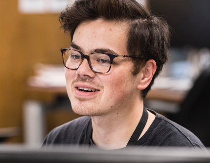

<section class="bio">
  
  

{{ site.description }}

  <ul class="sociallinks"><li>— <a target="_blank" href="#">{{ site.email }}</a>
</li><li>— <a target="_blank" href="#">{{ site.twitter_username }}</a></li></ul>
</section>

<h2>¸,ø¤º°`°º¤ø,¸,ø¤°º¤ø,¸¸,ø¤º°`°º¤ø,¸ Project notes ¸,ø¤º°`°º¤ø,¸,ø¤°º¤ø,¸¸,ø¤º°`°º¤ø,¸</h2>

<section class="projects">

  

  

    

    
<h3>{{ post.year }} {{ post.title }}</h3>
{{ post.description }}
      <a href="{{ post.url }}">Read more</a>
    

  

  

  

    

    
<h3>a.a.a - UK Parliament</h3>

First steps in a new website for Parliament, which aims to bring people closer to their MPs, Lords and ultimately democracy.
    

  

  

  

  
<h3>b.b.b - iPlayer</h3>
A brief look at the journey towards a better iPlayer homepage.
  

</section>

<h2>(¯`·._.·(¯`·._.·(¯`·._.·(¯`·._.·(¯`·._.·(¯`·._.· Things made ·._.·´¯)·._.·´¯)·._.·´¯)·._.·´¯)·._.·´¯)·._.·´¯)  </h2>

<section class="projects">

</section>
